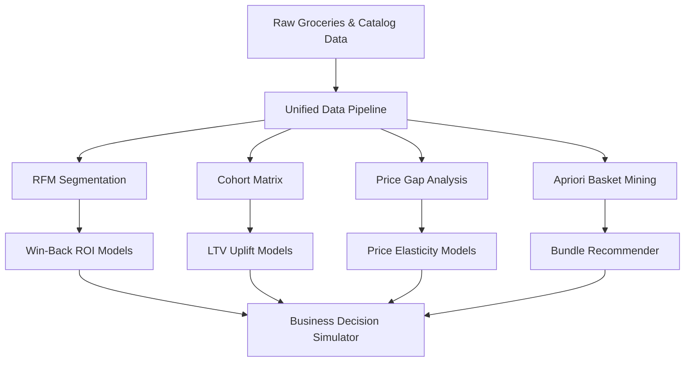

# 🛒 QC Pulse India

<p align="center">
  
  
  
  
  
</p>

<p align="center">
  <b>Quick Commerce Decision Intelligence Platform</b>
  <br>
  <sub>Analytical benchmarking framework for modern multi-platform delivery ecosystems</sub>
  <br>
  <code>Blinkit</code> · <code>Zepto</code> · <code>BigBasket</code> — pricing indices, cohort retention, and market basket affinities
</p>

---

<div align="center">
  <table>
    <tr>
      <td align="center"><b>🛒 39,357</b><br><sub>Catalog Products</sub></td>
      <td align="center"><b>👥 3,898</b><br><sub>Segmented Customers</sub></td>
      <td align="center"><b>📦 38,765</b><br><sub>Unified Transactions</sub></td>
      <td align="center"><b>📈 24</b><br><sub>Monthly Cohorts</sub></td>
      <td align="center"><b>⚙️ 8</b><br><sub>Functional Modules</sub></td>
      <td align="center"><b>🔮 3</b><br><sub>Scenario Simulators</sub></td>
    </tr>
  </table>
</div>

---

## 🎯 Platform Objectives & Key Features

**QC Pulse India** is an advanced decision-intelligence framework that processes transactional datasets to model competitive pricing strategies, customer retention dynamics, and purchase behaviors.

* **🎯 Scenario Sandbox Simulators**: An interactive simulation engine enabling multi-variable modeling:
  * **Win-Back Campaign ROI**: Projects re-engagement returns based on segment volume, campaign budgets, and discount incentives.
  * **Price Elasticity Modeling**: Simulates demand, volume, and top-line shifts across a continuous range of price variations using a retail elasticity coefficient of $-2.0$.
  * **Retention LTV Uplift**: Estimates lifetime value gains from targeting specific monthly cohort retention curve shifts.
* **🧪 Statistical Significance Validation**: Coded in pure Python and NumPy, the platform integrates an inline **Chi-Squared ($\chi^2$) Goodness-of-Fit test** to mathematically validate behavioral segmentation clustering patterns against a uniform distribution ($p < 0.001$).
* **🌊 Customer Journey Flow**: An interactive, multi-node Sankey flow tracking cohort transitions from the initial purchase category through active RFM segments to ultimate customer outcomes.
* **🎨 High-Contrast Dashboard Design**: Optimized visual structure leveraging deep slate backgrounds (`#060B14`), 2px linear top borders, and responsive grid layouts driven by standard Google Fonts (**DM Sans** and **Space Mono**).

---

## 🔍 Analytical Methodology & Insights

```
809 Champions (20.8%)    → order every 58 days, 6.3 avg orders, 3.6× higher LTV
889 Churned  (22.8%)     → inactive 400+ days, immediate win-back opportunity
June 2015 cohort         → 26.3% Month-1 retention (84% above 14.3% average)
Beverages-first buyers   → churn at 24.9% — highest of any acquisition category
Zepto                    → leads discounting; BigBasket premium in 4/6 categories
```

---

## 📈 System Architecture



### 1. Grocery-Adapted RFM Segmentation
- **Model**: Adjusted 7-day recency intervals specifically calibrated for high-frequency quick-commerce purchasing cycles.
- **Metric**: Champions register an average frequency of 6.3 transactions, driving **3.6× higher LTV** than the churned base.
- **Action**: Provides direct volume parameters to quantify costs and yields for targeting **889 Churned** and **761 At-Risk** consumers.

### 2. Cohort Retention & Lifetime Value Velocity
- **Model**: **24 monthly acquisition cohorts** monitored over a 24-month horizon (24×24 matrix).
- **Metric**: Identifies top performance in the June 2015 cohort (**26.3% Month-1 retention**), establishing an operational benchmark.
- **Action**: Simulates cohort shifts—improving Month-1 by 5pp retains **195 customers**, generating a projected **₹4.15M LTV uplift**.

### 3. Association Rules & Affinity Cross-Selling
- **Model**: Apriori transaction mining conducted on **14,963 unique orders** (`min_support=0.15%`, `min_confidence=15%`).
- **Metric**: Identifies key transaction affinities (e.g., specialty chocolate purchases drive a **1.65× lift** in citrus fruit baskets).
- **Action**: Generates actionable item bundles and localized category placement configurations.

---

## 🖥️ Dashboard Page Structure

| # | Dashboard Module | Analytical Objective | Applied Chart Formats |
|---|---|---|---|
| 1 | **📊 Overview** | High-level operations overview | Categorical inventory spreads, platform share donut charts. |
| 2 | **⚔️ Price Intelligence** | Competitor pricing gap indices | Multi-platform price heatmaps, discount distribution densities. |
| 3 | **⭐ Review & Rating** | Customer satisfaction metrics | Sentiment histograms, rating vs discount scatter correlations. |
| 4 | **🛒 Market Basket** | Affinity bundle optimization | Support vs Confidence bubble charts, rule association matrices. |
| 5 | **👥 Customer Segments** | Cluster behavioral classification | Segment treemaps, Recency-Frequency distribution scatter plots, **Chi-Squared validations**. |
| 6 | **📈 Cohort Retention** | Multi-cohort decay patterns | 24-cohort matrix heatmaps, Month-1 average retention trends. |
| 7 | **🌊 Customer Journey** | Transactional pathway tracking | Multi-node Sankey flow tracking category acquisition to outcomes. |
| 8 | **🎯 Business Simulator** | Scenario planning engine | campaign ROI charts, dynamic price optimization curves, gauge indicators. |

---

## 🎨 Visual Styling Parameters — "Vibrant Dark Space"

| Component / Utility | Style Definition | Color Configuration |
|---|---|---|
| **Base Theme Background** | Deep space slate | `#060B14` |
| **Metric Card Panels** | Linear glassmorphism gradient | `linear-gradient(135deg, #0F1C2E, #0D1823)` |
| **Card Top Accent Border** | 2px linear gradient line | `linear-gradient(90deg, #DC2626, #7C3AED)` |
| **Typography (Data labels)** | Space Mono (uppercase, 10px, letter-spacing 0.12em) | `#64748B` |
| **Typography (Metrics)** | DM Sans (700 weight, 30px) | `#F1F5F9` |
| **Functional Accent Colors** | Page status badges and highlights | Red (`#DC2626`) · Purple (`#7C3AED`) · Green (`#1D9E75`) |
| **Plotly Theme Integration** | Dark-themed coordinates | Plot BG: `#0D1823`, Hover label: `#0F1C2E`, Border: `#1E2D40` |

---

## 🚀 Execution & Setup

```bash
# 1. Clone the repository
git clone https://github.com/Yashaswini-V21/qc-pulse-india.git
cd QC_Pulse_India

# 2. Initialize virtual environment
python -m venv .venv
.venv\Scripts\activate        # Windows
# source .venv/bin/activate   # macOS/Linux

# 3. Upgrade package installer and install dependencies
python -m pip install --upgrade pip
pip install -r requirements.txt

# 4. Launch the Streamlit server
streamlit run app.py
```

---

## 📁 Repository Structure

```
QC_Pulse_India/
├── app.py                    # Routing hub and design system injection
├── run_pipeline.py           # Reproducible data cleaning pipeline execution script
├── requirements.txt          # Production package requirements
├── LICENSE                   # MIT License
│
├── views/                    # ★ Single-Responsibility Dashboard View Renderers
│   ├── overview.py           # Dashboard overview metrics & platforms
│   ├── price_intelligence.py # Category price metrics and platform gap indices
│   ├── review_rating.py      # Rating distribution & brand sentiment audits
│   ├── market_basket.py      # Apriori transaction associations & cross-sell
│   ├── customer_segments.py  # RFM segmentations, chi-squared tests
│   ├── cohort_retention.py   # Heatmap retention matrices and curves
│   ├── customer_journey.py   # Flow metrics and Sankey charts
│   └── business_simulator.py # campaign ROI, price elasticity, retention projection
│
├── utils/                    # Data loaders, layout configurations & simulators
│   ├── config.py             # Centralized metrics, color indices, and simulation parameters
│   ├── data_loader.py        # Cached CSV loading, cleaning & validation
│   ├── styles.py             # Vibrant Dark Space CSS stylesheet definition
│   ├── charts.py             # Custom Plotly chart theme parameters
│   ├── simulator.py          # Win-Back, Price, and Retention simulators
│   └── story_generator.py    # Dynamic narrative analytics text generator
│
├── data/
│   ├── raw/                  # Original platform CSV data slices
│   └── clean/                # Clean unified analytical CSV targets
│
├── notebooks/                # Development pipeline Jupyter notebooks (01→07)
│   ├── 01_data_load.ipynb
│   └── ...
│
├── tests/                    # Testing framework (pytest validation tests)
│   └── test_data_loader.py
│
└── docs/
    ├── DEVELOPER_GUIDE.md    # Staging & container deployment guidelines
    └── data_schema.md        # Column definitions and schemas
```

---

## 🌐 Production Cloud Hosting

### Streamlit Community Cloud (Staging Setup)
1. Commit and push the codebase to a public GitHub repository branch.
2. Log into [share.streamlit.io](https://share.streamlit.io/) via GitHub.
3. Select **New app**, select this repository branch, and set the entry file to `app.py`.
4. Click **Deploy**. Packages listed in `requirements.txt` will install automatically.

### Containerized Deployment (Docker)
Create a standard `Dockerfile` in the root:
```dockerfile
FROM python:3.9-slim
ENV PYTHONDONTWRITEBYTECODE=1 PYTHONUNBUFFERED=1 STREAMLIT_SERVER_PORT=8501
WORKDIR /app
COPY requirements.txt .
RUN pip install --no-cache-dir -r requirements.txt
COPY . .
EXPOSE 8501
ENTRYPOINT ["streamlit", "run", "app.py"]
```
Build and execute:
```bash
docker build -t qc-pulse-india:latest .
docker run -d -p 8501:8501 qc-pulse-india:latest
```

---

<p align="center">
  <b>Built by Yashaswini V</b> · May 2026
  <br>
  <sub>Unified Decision Intelligence Framework for Quick Commerce Analytics</sub>
</p>
