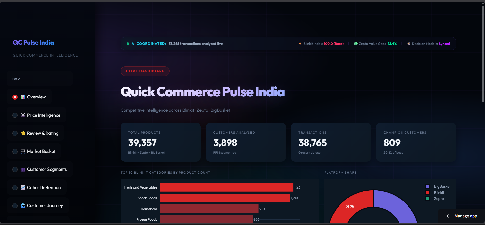
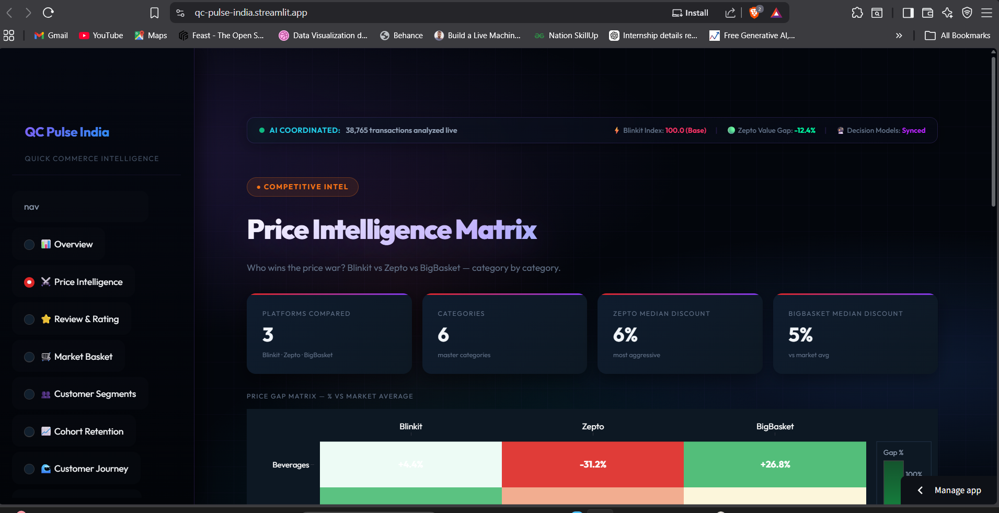
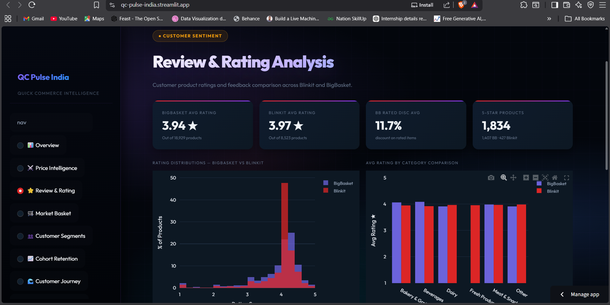
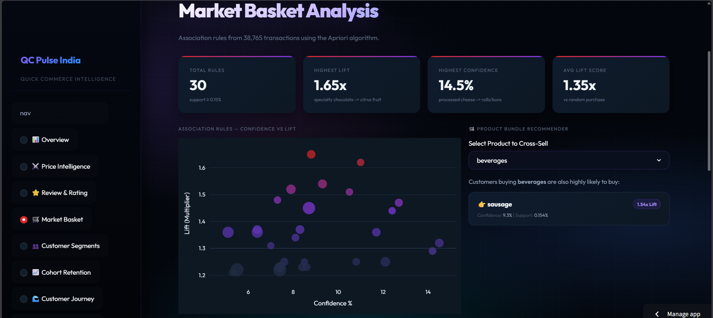
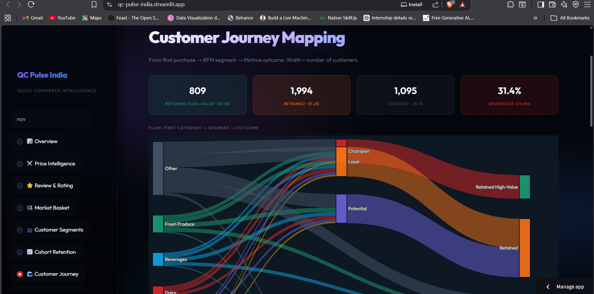

<div align="center">

# 🛒 QC Pulse India

### Quick Commerce Analytics Dashboard
#### Blinkit · Zepto · BigBasket

<br>

[](https://qc-pulse-india.streamlit.app)
[](https://python.org)
[](https://streamlit.io)
[](LICENSE)

<br>

> A student data analytics project comparing pricing, customer segments, and purchase behaviour  
> across three Indian quick commerce platforms — built with Python and Streamlit.

<br>

| 🛒 39,357 | 👥 3,898 | 📦 38,765 | 📈 24 Cohorts | 🎯 8 Modules |
|:---------:|:--------:|:---------:|:-------------:|:------------:|
| Products | Customers | Transactions | Tracked | Dashboard Pages |

</div>

---

## 📸 Screenshots

<br>

**Overview — Platform KPIs & Category Distribution**


<br>

**Price Intelligence — Category-wise Price Gap Matrix**


<br>

**Review & Rating Analysis — Sentiment Comparison**


<br>

**Market Basket Analysis — Association Rules & Cross-Sell**


<br>

**Customer Journey Mapping — First Purchase → Segment → Outcome**


---

## 📋 Dashboard Pages

| # | Page | What it shows |
|---|------|---------------|
| 1 | 📊 Overview | Products, customers, transactions, platform share |
| 2 | ⚔️ Price Intelligence | Price gap % vs market average — who is cheapest per category |
| 3 | ⭐ Review & Rating | Rating distributions and averages by platform and category |
| 4 | 🛒 Market Basket | Apriori association rules, product cross-sell recommendations |
| 5 | 👥 Customer Segments | RFM segmentation — Champions, Loyal, At-Risk, Churned |
| 6 | 📈 Cohort Retention | 24-month retention heatmap and Month-1 trend |
| 7 | 🌊 Customer Journey | Sankey flow: first category → RFM segment → outcome |
| 8 | 🎯 Business Simulator | Win-back ROI, price elasticity, retention LTV uplift |

---

## 🔍 Key Numbers

```
39,357   products across Blinkit + Zepto + BigBasket
 3,898   customers (RFM segmented)
38,765   transactions in the dataset
   809   Champion customers — 20.8% of base, 3.6× higher LTV
   889   Churned customers — inactive 400+ days
Zepto    leads discounting at 6% median — most aggressive pricer
June 2015 cohort → 26.3% Month-1 retention (best performing)
Beverages first-buyers → 31.4% churn — highest of all categories
```

---

## 🛠 Tech Stack

| Tool | Use |
|------|-----|
| Python 3.10+ | Core language |
| Streamlit | Dashboard framework |
| Pandas / NumPy | Data processing |
| Plotly | Charts and visualisations |
| mlxtend | Apriori market basket algorithm |

---

## 🚀 Run Locally

```bash
# Clone
git clone https://github.com/Yashaswini-V21/qc-pulse-india.git
cd QC_Pulse_India

# Virtual environment
python -m venv .venv
.venv\Scripts\activate        # Windows
# source .venv/bin/activate   # macOS / Linux

# Install
pip install -r requirements.txt

# Launch
streamlit run app.py
```

> **Before running:** Execute notebooks `01` → `07` inside `notebooks/` to generate the processed data files.

---

## 📁 Project Structure

```
QC_Pulse_India/
├── app.py                    # Main app — page routing + CSS injection
├── requirements.txt
├── run_pipeline.py           # Runs all notebooks in sequence
│
├── views/                    # One file per dashboard page
│   ├── overview.py
│   ├── price_intelligence.py
│   ├── review_rating.py
│   ├── market_basket.py
│   ├── customer_segments.py
│   ├── cohort_retention.py
│   ├── customer_journey.py
│   └── business_simulator.py
│
├── utils/                    # Shared utilities
│   ├── data_loader.py        # Loads + caches all CSVs
│   ├── styles.py             # Dark theme CSS
│   ├── charts.py             # Plotly theme config
│   ├── simulator.py          # Business simulation logic
│   ├── config.py             # Constants and parameters
│   └── story_generator.py    # Insight text generator
│
├── data/
│   ├── raw/                  # Original platform CSVs
│   └── clean/                # Processed files
│
├── notebooks/                # Data pipeline (01 → 07)
├── public/                   # Screenshots for this README
├── tests/                    # pytest tests
└── docs/
    ├── data_schema.md
    └── DEVELOPER_GUIDE.md
```

---

## 📄 License

MIT — see [LICENSE](LICENSE)

---

<div align="center">

Made by **Yashaswini V** &nbsp;·&nbsp; May 2026 &nbsp;·&nbsp; DATA ANALYTICS PROJECT 

[](https://github.com/Yashaswini-V21/qc-pulse-india)

</div>
