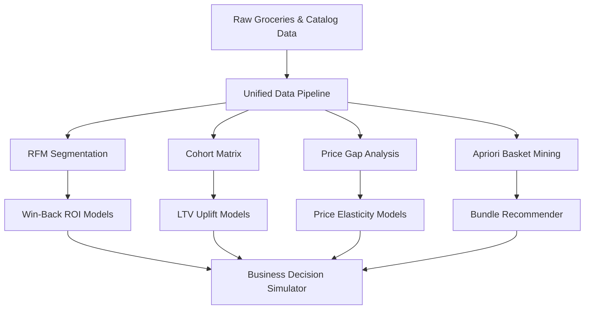

# 🛒 QC Pulse India

<p align="center">
  
  
  
  
  
</p>

<p align="center">
  <b>Quick Commerce Decision Intelligence Platform</b>
  <br>
  <sub>Premium analytics dashboard for India's 10-minute delivery ecosystem</sub>
  <br>
  <code>Blinkit</code> · <code>Zepto</code> · <code>BigBasket</code> — pricing, retention, segmentation & simulation
</p>

---

<div align="center">
  <table>
    <tr>
      <td align="center"><b>🛒 39,357</b><br><sub>Products</sub></td>
      <td align="center"><b>👥 3,898</b><br><sub>Customers</sub></td>
      <td align="center"><b>📦 38,765</b><br><sub>Transactions</sub></td>
      <td align="center"><b>📈 24</b><br><sub>Cohorts</sub></td>
      <td align="center"><b>⚙️ 8</b><br><sub>Modules</sub></td>
      <td align="center"><b>🔮 3</b><br><sub>Simulators</sub></td>
    </tr>
  </table>
</div>

---

## 🎯 Platform Differentiators (Built for 15+ LPA Analytics Roles)

Most portfolios show static charts. **QC Pulse India** is a decision-intelligence engine designed for high-growth tech firms:

* **🎯 Interactive Business Simulator**: Model scenarios using real data: Win-Back Campaign ROI, Price Elasticity Impact (elasticity coefficient of $-2.0$), and Cohort Retention LTV Uplift.
* **🧪 Mathematical Grouping Validation**: An inline **Chi-Squared ($\chi^2$) Goodness-of-Fit test** to statistically prove behavioral clustering significance ($p < 0.001$), coded from scratch in pure Python/Numpy.
* **🌊 Multi-Stage Customer Journey Sankey**: A self-contained flow mapping customer acquisition categories to final RFM segments and outcomes.
* **🎨 Vibrant Dark Space UI**: A terminal design using deep navy backgrounds (`#060B14`), 2px top gradient borders, custom interactive Plotly configurations, and Google Fonts (**DM Sans** + **Space Mono**).

---

## 🔍 Key Strategic Insights

```
809 Champions (20.8%)    → order every 58 days, 6.3 avg orders, 3.6× higher LTV
889 Churned  (22.8%)     → inactive 400+ days, immediate win-back opportunity
June 2015 cohort         → 26.3% Month-1 retention (84% above 14.3% average)
Beverages-first buyers   → churn at 24.9% — highest of any acquisition category
Zepto                    → leads discounting; BigBasket premium in 4/6 categories
```

---

## 📈 Platform Architecture



### 1. Grocery-Adapted RFM Segmentation
- **Methodology**: 7-day recency threshold for daily/weekly grocery cycles (vs. standard 30-day).
- **Business Metric**: Champions buy every 58 days, avg 6.3 orders $\rightarrow$ **3.6× higher LTV** than churned.
- **Actionable ROI**: Models exact cost-per-recovery for re-engaging **889 Churned** and **761 At-Risk** customers.

### 2. Cohort Retention & LTV Velocity
- **Methodology**: **24 monthly acquisition cohorts** tracked across 2 full years (24×24 matrix).
- **Finding**: June 2015 cohort = **26.3% Month-1 retention** (84% above average).
- **Leverage**: Improving Month-1 by 5pp saves **195 customers** $\rightarrow$ **₹4.15M annual LTV uplift**.

### 3. Apriori Basket Cross-Selling Intelligence
- **Methodology**: Market-basket analysis on **14,963 unique trips** at `min_support=0.15%`, `min_confidence=15%` $\rightarrow$ **30 association rules**.
- **Finding**: Specialty chocolate triggers **1.65× lift** in citrus fruit purchases (62.5% confidence).
- **Action**: Powers recommendation engines, bundle packages, and shelf placements to grow AOV.

---

## 🖥️ Dashboard Page Modules

| # | Page Module | Focus Area | Technical Visualizations |
|---|---|---|---|
| 1 | **📊 Overview** | Health Indicators | Blinkit top 10 categories bar chart, platform share donut chart. |
| 2 | **⚔️ Price Intelligence** | Competitor Benchmarking | Price gap heat-grid, category-level price indexes. |
| 3 | **⭐ Review & Rating** | Customer Satisfaction | Ratings frequency distribution, discount vs rating scatter plot. |
| 4 | **🛒 Market Basket** | Cross-Sell Analysis | Apriori rules bubble chart, interactive bundle recommender. |
| 5 | **👥 Customer Segments** | Behavioral Clustering | RFM treemap, Recency vs Frequency scatter, **Chi-Squared statistical test**. |
| 6 | **📈 Cohort Retention** | Long-Term Engagement | 24-cohort heatmap matrix, cohort-level retention trend diagnostics. |
| 7 | **🌊 Customer Journey** | Retention Flows | Multi-node Sankey flow tracking category acquisition to outcomes. |
| 8 | **🎯 Business Simulator** | What-If Decision Engine | Win-Back ROI, Price Change Elasticity, Retention LTV indicators. |

---

## 🎨 Visual Design Tokens — "Vibrant Dark Space"

| Token | CSS Target / Style Rule | Accent Hex Color |
|---|---|---|
| **Background Color** | `#060B14` (Deep space navy) | - |
| **Card Styling** | `linear-gradient(135deg, #0F1C2E, #0D1823)` | - |
| **Top Border Gradient** | 2px top accent line on metric cards | `linear-gradient(90deg, #DC2626, #7C3AED)` |
| **Monospace Typography** | Space Mono (uppercase, 10px, color `#64748B`, letter-spacing 0.12em) | - |
| **Value Typography** | DM Sans (700 weight, 30px, color `#F1F5F9`) | - |
| **Accent Colors** | Active page badges and indicators | Red (`#DC2626`) · Purple (`#7C3AED`) · Green (`#1D9E75`) |
| **Plotly Theming** | Paper/Plot BG: `#0D1823`, Hover label: `#0F1C2E`, Hover border: `#1E2D40` | - |

---

## 🚀 Quick Start Guide

```bash
# 1. Clone the repository
git clone https://github.com/Yashaswini-V21/qc-pulse-india.git
cd QC_Pulse_India

# 2. Setup your virtual environment
python -m venv .venv
.venv\Scripts\activate        # Windows
# source .venv/bin/activate   # macOS/Linux

# 3. Upgrade pip and install dependencies
python -m pip install --upgrade pip
pip install -r requirements.txt

# 4. Launch the application
streamlit run app.py
```

---

## 📁 Directory Architecture

```
QC_Pulse_India/
├── app.py                    # Entry point — routing + premium CSS injection
├── config.py                 # Centralized colors, fonts, simulation constants, paths
├── run_pipeline.py           # Reproducible notebooks execution pipeline
├── requirements.txt          # Production package requirements
├── LICENSE                   # MIT License
│
├── views/                    # ★ Single-Responsibility Page View Modules
│   ├── overview.py           # Dashboard overview metrics & platforms
│   ├── price_intelligence.py # heatmap pricing indexes and margins
│   ├── review_rating.py      # Rating distribution & brand audits
│   ├── market_basket.py      # Apriori associations & bundles
│   ├── customer_segments.py  # RFM segmentations, chi-squared tests
│   ├── cohort_retention.py   # Heatmap retention tables and curves
│   ├── customer_journey.py   # Flow metrics and Sankey charts
│   └── business_simulator.py # ROI Win-Back, price elasticity models
│
├── utils/                    # Data parsing, UI styling & simulators
│   ├── data_loader.py        # Cached CSV loading, cleaning & validation
│   ├── styles.py             # Vibrant Dark Space CSS injection
│   ├── charts.py             # Plotly custom layout theming
│   ├── simulator.py          # Win-Back, Price, and Retention simulators
│   └── story_generator.py    # Automated insights narratives
│
├── data/
│   ├── raw/                  # Platform unprocessed snaps (Blinkit, Zepto, BB)
│   └── clean/                # Clean unified analytical CSV targets
│
├── notebooks/                # Sequential pipeline development (01→07)
│   ├── 01_data_load.ipynb
│   └── ...
│
├── tests/                    # Schema validations (pytest suite)
│   └── test_data_loader.py
│
└── docs/
    ├── DEVELOPER_GUIDE.md    # Staging & container deployment guidelines
    ├── data_schema.md        # Column definitions and schemas
    └── PROJECT_REVIEW_RATING.md # Hiring manager audit guide
```

---

## 🌐 Production Cloud Hosting Guide

### Streamlit Community Cloud (1-Click Deployment)
1. Push this codebase to a public GitHub repository.
2. Log into [share.streamlit.io](https://share.streamlit.io/) via GitHub.
3. Select **New app**, choose this repository, and set the main file path to `app.py`.
4. Click **Deploy**. Streamlit automatically installs requirements from `requirements.txt`.

### Containerized Deployment (Docker)
Create a standard `Dockerfile` in the root:
```dockerfile
FROM python:3.9-slim
ENV PYTHONDONTWRITEBYTECODE=1 PYTHONUNBUFFERED=1 STREAMLIT_SERVER_PORT=8501
WORKDIR /app
COPY requirements.txt .
RUN pip install --no-cache-dir -r requirements.txt
COPY . .
EXPOSE 8501
ENTRYPOINT ["streamlit", "run", "app.py"]
```
Build and run locally:
```bash
docker build -t qc-pulse-india:latest .
docker run -d -p 8501:8501 qc-pulse-india:latest
```

---

<p align="center">
  <b>Built by Yashaswini V</b> · May 2026 · <code>Production Ready</code>
  <br>
  <sub>Designed with the "Vibrant Dark Space" aesthetic — because your data deserves to look as good as it performs.</sub>
</p>
