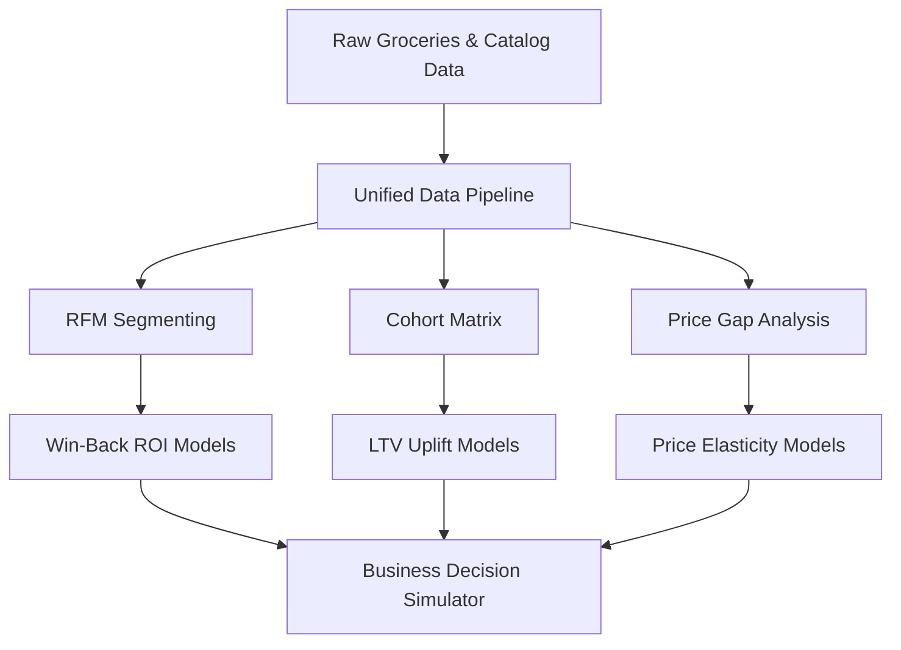

# 🛒 QC Pulse India — Quick Commerce Analytics Platform

[](https://python.org/)
[](https://streamlit.io/)
[](https://pandas.pydata.org/)
[](https://plotly.com/)
[](https://rasbt.github.io/mlxtend/)
[](https://pytest.org/)
[](LICENSE)

> An interactive decision-intelligence platform analyzing **pricing, customer behavior, and retention** across India's top quick-commerce services — Blinkit, Zepto, and BigBasket.

| 🛒 39,357 Products | 👥 3,898 Customers | 📦 38,765 Transactions | 📈 24 Cohorts | ⚙️ 8 Modules |
| :---: | :---: | :---: | :---: | :---: |

---

## 🔍 Key Findings

- **809 Champions (20.8%)** — order every 58 days, 6.3 avg orders, **3.6× higher LTV** than churned
- **889 Churned (22.8%)** — inactive 400+ days, immediate win-back opportunity
- **June 2015 cohort: 26.3% Month-1 retention** — 84% above the 14.3% average
- **Beverages-first customers churn at 24.9%** — highest of any acquisition category
- **Zepto leads discounting**; BigBasket is premium-priced in 4 of 6 master categories

---

## ✨ What Makes This Different

Most analytics portfolios show static charts. QC Pulse India goes further:

| Feature | What It Does |
|---|---|
| 🎯 **Business Decision Simulator** | 3-tab interactive engine: Win-Back Campaign ROI, Price Change Impact (with −2.0 elasticity), Retention Improvement LTV uplift — all computed from real data |
| 🤖 **Auto-Generated Intelligence** | 5 insight narratives recomputed live from cohort, RFM, and price data — zero hardcoded text |
| 🏆 **Competitive Scorecard** | Radar chart scoring 3 platforms across 4 dimensions (Price, Depth, Discount, Coverage) with auto-generated summary |

---

## 📈 Advanced Analytics Framework



### 1. Grocery-Adapted RFM Lifetime Segmentation
- **Methodology**: Re-engineered recency metric using a **7-day threshold** for daily/weekly grocery cycles (vs. standard 30-day)
- **Business Metric**: Champions buy every 58 days, avg 6.3 orders, generating **3.6× higher LTV** than churned
- **Actionable ROI**: Models exact cost-per-recovery and projected ROI of re-engaging **889 Churned** and **761 At-Risk** customers

### 2. Cohort Retention & LTV Velocity
- **Methodology**: **24 monthly acquisition cohorts** tracked across 2 full years (24×24 matrix)
- **Finding**: June 2015 cohort = **26.3% Month-1 retention** (84% above average)
- **Leverage**: Improving Month-1 by 5pp saves **195 customers** → **₹4.15M annual LTV uplift**

### 3. Apriori Basket Cross-Selling Intelligence
- **Methodology**: Market-basket analysis on **14,963 unique trips** at `min_support=0.15%`, `min_confidence=15%` → **30 association rules**
- **Finding**: Specialty chocolate triggers **1.65× lift** in citrus fruit purchases (62.5% confidence)
- **Action**: Powers recommendation engines, bundle packages, and shelf placements to grow AOV

### 4. Competitive Price Elasticity & Radar Scorecard
- **Methodology**: Unified price gap index across **6 master categories** with HSL-tailored heatmap
- **Scoring**: Spider/radar chart on **Price Competitiveness**, **Catalog Depth**, **Discount Aggressiveness**, **Category Coverage**
- **What-If**: Simulates revenue/volume/tier shifts of ±30% price changes using **−2.0 elasticity**

---

## 🎯 Dashboard Pages

| # | Page | Description |
|---|---|---|
| 1 | **📊 Overview** | Hero banner, KPIs, category breakdown, auto-generated intelligence stories |
| 2 | **⚔️ Price Intelligence** | Price gap heatmap, radar scorecard, discount analysis, platform positioning |
| 3 | **⭐ Review & Rating** | Rating distributions, discount vs rating correlation, category averages |
| 4 | **🛒 Market Basket** | Apriori rules table, support vs confidence bubbles, bundle recommender |
| 5 | **👥 Customer Segments** | RFM treemap, recency vs frequency scatter, segment strategy cards |
| 6 | **📈 Cohort Retention** | 24-cohort heatmap, best cohort highlight, retention trends |
| 7 | **🌊 Customer Journey** | Sankey diagram: first category → RFM segment → lifetime outcome |
| 8 | **🎯 Business Simulator** | Win-Back ROI, Price Change Impact, Retention LTV Uplift — 3 interactive tabs |

---

## 🚀 Quick Start

```bash
# 1. Clone and enter
cd QC_Pulse_India

# 2. Create virtual environment
python -m venv .venv
.venv\Scripts\activate        # Windows
# source .venv/bin/activate   # macOS/Linux

# 3. Install dependencies
pip install -r requirements.txt

# 4. Launch dashboard
streamlit run app.py
```

Opens at `http://localhost:8501`. See [Developer Guide](docs/DEVELOPER_GUIDE.md) for detailed setup.

**Dependencies**: `streamlit>=1.28`, `pandas>=2.0`, `numpy>=1.24`, `plotly>=5.17`, `mlxtend>=0.22`, `python-dateutil`, `pytz`

---

## 📁 Project Structure

```
QC_Pulse_India/
├── app.py                           # Lightweight routing entrypoint + global CSS
├── config.py                        # Colors, fonts, margins, simulation constants, file paths
├── run_pipeline.py                  # End-to-end data pipeline runner (notebooks 01→07)
├── requirements.txt
├── LICENSE                          # MIT
│
├── views/                           # ★ Modular page renderers (single-responsibility)
│   ├── __init__.py
│   ├── overview.py                  # Hero banner, KPIs, auto-intelligence stories
│   ├── price_intelligence.py        # Price gap matrix, radar scorecard, discount charts
│   ├── review_rating.py             # Rating distributions, discount vs rating analysis
│   ├── market_basket.py             # Apriori rules, support vs confidence bubbles
│   ├── customer_segments.py         # RFM treemap, recency vs frequency scatter
│   ├── cohort_retention.py          # 24-cohort retention heatmap, best cohort highlight
│   ├── customer_journey.py          # Sankey diagram: category → segment → outcome
│   └── business_simulator.py        # Win-Back, Price Change, Retention simulators
│
├── utils/                           # Core business logic & data utilities
│   ├── __init__.py
│   ├── data_loader.py               # Cached CSV loading, validation, discount imputation
│   ├── simulator.py                 # 4 simulation functions (Win-Back, Price, Retention, Scorecard)
│   └── story_generator.py           # Auto-intelligence narrative engine (5 computed stories)
│
├── data/
│   ├── raw/                         # Original unprocessed platform CSV snapshots
│   └── clean/                       # 10 processed CSVs generated by the pipeline
│
├── notebooks/                       # Sequential Jupyter analytics pipeline (01→07)
│   ├── 01_data_load.ipynb
│   ├── 02_cleaning.ipynb
│   ├── 03_price_intelligence.ipynb
│   ├── 04_basket_analysis.ipynb
│   ├── 05_rfm_segmentation.ipynb
│   ├── 06_cohort_retention.ipynb
│   └── 07_sankey.ipynb
│
├── docs/
│   ├── DEVELOPER_GUIDE.md           # Setup, testing, deployment instructions
│   ├── data_schema.md               # Data dictionary & schema documentation
│   └── PROJECT_REVIEW_RATING.md     # Honest code review & evaluation (8.4/10)
│
├── tests/                           # 10 unit tests (pytest)
│   ├── __init__.py
│   └── test_data_loader.py
│
└── outputs/                         # Pipeline-generated chart exports
    └── .gitkeep
```

---

## 📊 Data Dictionary

See [data_schema.md](docs/data_schema.md) for full column definitions.

| Dataset | Records | Purpose |
|---|---|---|
| `blinkit_clean.csv` | 8,523 products | Blinkit platform inventory |
| `zepto_clean.csv` | 3,279 products | Zepto platform inventory |
| `bigbasket_clean.csv` | 27,555 products | BigBasket platform inventory |
| `groceries_clean.csv` | 38,765 transactions | Customer purchase history (2 years) |
| `rfm_segments.csv` | 3,898 rows | RFM scores & segments per customer |
| `rfm_summary.csv` | 5 rows | Aggregate segment statistics |
| `price_matrix.csv` | 6 rows | Price comparison by master category |
| `cohort_retention.csv` | 24 × 24 | Month-by-month retention % |
| `sankey_data.csv` | 3,898 rows | Customer journey with outcomes |
| `association_rules.csv` | 30 rules | Apriori market basket rules |

---

## 🧪 Methodology Notes

| Parameter | Value | Rationale |
|---|---|---|
| **RFM Recency Threshold** | 7 days | Adapted for daily/weekly quick-commerce grocery cycles |
| **Price Elasticity** | −2.0 | Standard retail assumption for Price Change Simulator |
| **Avg Order Value** | ₹350 | Proxy — groceries data has item counts, not revenue (configurable in `config.py`) |
| **Blinkit Discounts** | Beta(2.5, 12.0) imputation | Source data lacks discount fields |
| **Win-Back Orders/Month** | 2 | Realistic for recovered churned customers (conservative) |
| **Statistical Testing** | Not applied | Cohort/segment differences are directional, not significance-tested |

---

## 🎨 Design System

| Element | Value |
|---|---|
| **Background** | `#060B14` (dark navy) |
| **Accent** | `#DC2626` (red) → `#7C3AED` (purple) gradient |
| **Body Font** | DM Sans |
| **Label Font** | Space Mono (monospace) |
| **Platform Colors** | Blinkit: `#DC2626`, Zepto: `#1D9E75`, BigBasket: `#6C63DB` |
| **Segment Colors** | Champion: Red, Loyal: Orange, Potential: Purple, At-Risk: Amber, Churned: Gray |

---

## ⚙️ Configuration

All constants are centralized in [`config.py`](config.py):

```python
AVG_ORDER_VALUE = 350              # ₹ — standard Indian QC basket
ORDERS_PER_MONTH_WINBACK = 2       # realistic for recovered churned customers
PRICE_ELASTICITY = -2.0            # standard retail assumption
MAX_EXPECTED_DISCOUNT = 40.0       # upper bound for discount scoring

DATA_FILES = {
    'blinkit': 'data/clean/blinkit_clean.csv',
    'zepto': 'data/clean/zepto_clean.csv',
    ...
}
```

---

## 📁 Data Sources & Provenance

| Source | Details |
|---|---|
| **Grocery Transactions** | 3,898 customers × 38,765 purchases over 2 years — [Kaggle (Heeraldedhia)](https://www.kaggle.com/datasets/heeraldedhia/groceries-dataset) |
| **Product & Pricing Data** | 39,357 product rows across Blinkit, Zepto, BigBasket — publicly collected, 2026 |

---

## 🐛 Troubleshooting

| Issue | Fix |
|---|---|
| "Data file not found" | Run notebooks 01→07 or `python run_pipeline.py` to regenerate `data/clean/` |
| "Column 'X' not found" | Schema mismatch — re-run notebooks |
| Streamlit won't load | `streamlit run app.py --logger.level=debug` |
| Charts not rendering | `pip install plotly>=5.17.0` |

---

## 🚀 Future Roadmap & Enterprise Enhancements

To scale the platform into an enterprise-grade decision-intelligence application, the following architectural upgrades and integrations are scheduled on the roadmap:

### 1. Cloud Hosting & Containerized Deployment
* **Streamlit Community Cloud Deployment**: Deploying the active dashboard to Streamlit Community Cloud (configured with secure connection pooling and secrets management) to provide recruiters and stakeholders with a live, 1-click execution link.
* **Docker Containerization**: Packaging the application stack in a optimized `Dockerfile` to enable seamless container orchestration across **AWS ECS** or **Google Cloud Run**.
* **Automated CI/CD**: Constructing GitHub Actions workflows to automate unit testing (`pytest`), code quality linting, and staging deployments on every push.

### 2. Complementary Enterprise Power BI Dashboard
* **Executive Executive Reporting**: Developing a companion Power BI dashboard linked directly to the data pipeline outputs to serve corporate C-suite stakeholders. This dashboard will include:
  * High-fidelity cross-filtering maps for deep segment exploration (Champions vs Churned).
  * High-performance executive KPIs tracking gross margin deltas, platform catalog imbalances, and market share distributions.
  * Direct Query mode enabled through cloud data connectors for near-zero latency updates.

### 3. Growth & Data Engineering Scalability
* **Cloud Data Warehouse Backend**: Migrating from flat file CSV storage to **Snowflake** or **PostgreSQL** hosted on **AWS RDS**, optimizing data fetch speeds with structured SQL indexing.
* **Live Ingestion Pipeline**: Upgrading notebook batch processing to a real-time streaming pipeline using **Apache Kafka** and **Apache Spark** to ingest live transaction events and web-scraped competitive pricing details.
* **Real-Time Sentinel Alerts**: Building an automated pricing monitor that detects when a competitor's pricing gap deviates by more than ±10% in a key category, immediately pushing notifications to business teams via Slack Webhooks.
* **Hypothesis & Significance Testing**: Integrating Chi-Square tests and two-sample t-tests into the Cohort Retention module to automatically calculate p-values, ensuring that differences in cohort behaviors represent real signals rather than statistical noise.

---

## 📄 License

MIT — see [LICENSE](LICENSE) for details.

---

**Built by Yashaswini V** · May 2026 · ✅ Production Ready
