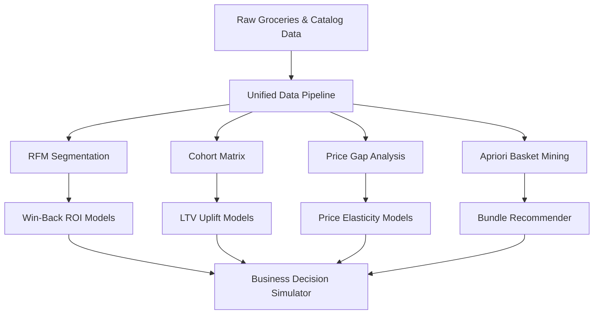

<p align="center">
  
  
  
  
  
  
</p>

<h1 align="center">
  🛒 QC Pulse India
</h1>

<p align="center">
  <b>Quick Commerce Decision Intelligence Platform</b>
  <br>
  <sub>Premium analytics dashboard for India's 10-minute delivery ecosystem</sub>
</p>

<p align="center">
  <code>Blinkit</code> · <code>Zepto</code> · <code>BigBasket</code> — pricing, retention, segmentation & simulation
</p>

---

<table>
  <tr>
    <td align="center"><b>🛒 39,357</b><br><sub>Products</sub></td>
    <td align="center"><b>👥 3,898</b><br><sub>Customers</sub></td>
    <td align="center"><b>📦 38,765</b><br><sub>Transactions</sub></td>
    <td align="center"><b>📈 24</b><br><sub>Cohorts</sub></td>
    <td align="center"><b>⚙️ 8</b><br><sub>Modules</sub></td>
    <td align="center"><b>🔮 3</b><br><sub>Simulators</sub></td>
  </tr>
</table>

---

## 🎯 What Makes This Different

Most analytics portfolios show static charts. **QC Pulse India** is a full decision-intelligence engine:

| Feature | Description |
|---|---|
| 🎯 **Business Decision Simulator** | 3-tab interactive engine: Win-Back Campaign ROI, Price Change Impact (−2.0 elasticity), Retention LTV Uplift — all computed from real data |
| 🤖 **Auto-Generated Intelligence** | 5 insight narratives recomputed live from cohort, RFM, and price data — zero hardcoded text |
| 🏆 **Competitive Scorecard** | Radar chart scoring 3 platforms across 4 dimensions with auto-generated executive summary |
| 🎨 **"Dark Intelligence" UI** | Vercel × Linear × Bloomberg Terminal aesthetic — glassmorphism, micro-animations, Inter typography |

---

## 🔍 Key Findings

```
809 Champions (20.8%)    → order every 58 days, 6.3 avg orders, 3.6× higher LTV
889 Churned  (22.8%)     → inactive 400+ days, immediate win-back opportunity
June 2015 cohort         → 26.3% Month-1 retention (84% above 14.3% average)
Beverages-first buyers   → churn at 24.9% — highest of any acquisition category
Zepto                    → leads discounting; BigBasket premium in 4/6 categories
```

---

## 📈 Analytics Architecture



### 1. Grocery-Adapted RFM Segmentation
- **Methodology**: 7-day recency threshold for daily/weekly grocery cycles (vs. standard 30-day)
- **Business Metric**: Champions buy every 58 days, avg 6.3 orders → **3.6× higher LTV** than churned
- **Actionable ROI**: Models exact cost-per-recovery for re-engaging **889 Churned** and **761 At-Risk** customers

### 2. Cohort Retention & LTV Velocity
- **Methodology**: **24 monthly acquisition cohorts** tracked across 2 full years (24×24 matrix)
- **Finding**: June 2015 cohort = **26.3% Month-1 retention** (84% above average)
- **Leverage**: Improving Month-1 by 5pp saves **195 customers** → **₹4.15M annual LTV uplift**

### 3. Apriori Basket Cross-Selling Intelligence
- **Methodology**: Market-basket analysis on **14,963 unique trips** at `min_support=0.15%`, `min_confidence=15%` → **30 association rules**
- **Finding**: Specialty chocolate triggers **1.65× lift** in citrus fruit purchases (62.5% confidence)
- **Action**: Powers recommendation engines, bundle packages, and shelf placements to grow AOV

### 4. Competitive Price Elasticity & Radar Scorecard
- **Methodology**: Unified price gap index across **6 master categories** with HSL-tailored heatmap
- **Scoring**: Spider/radar chart — **Price Competitiveness**, **Catalog Depth**, **Discount Aggressiveness**, **Category Coverage**
- **What-If**: Simulates revenue/volume/tier shifts of ±30% price changes using **−2.0 elasticity**

---

## 🖥️ Dashboard Pages

| # | Page | Description |
|---|---|---|
| 1 | **📊 Overview** | Premium hero section, KPIs, category breakdown, 5 auto-generated intelligence stories |
| 2 | **⚔️ Price Intelligence** | Price gap heatmap, radar scorecard, discount analysis, platform positioning cards |
| 3 | **⭐ Review & Rating** | Rating distributions, discount vs rating correlation, interactive brand explorer |
| 4 | **🛒 Market Basket** | Apriori rules bubble chart, interactive bundle recommender, data table |
| 5 | **👥 Customer Segments** | RFM treemap, recency vs frequency scatter, segment strategy cards |
| 6 | **📈 Cohort Retention** | 24-cohort heatmap, per-month bar analysis, trend line with best/worst markers |
| 7 | **🌊 Customer Journey** | Sankey diagram: first category → RFM segment → lifetime outcome |
| 8 | **🎯 Business Simulator** | Win-Back ROI, Price Change Impact, Retention LTV Uplift — 3 interactive tabs |

---

## 🎨 Design System — "Dark Intelligence"

> Aesthetic inspired by: **Vercel Dashboard** × **Linear App** × **Bloomberg Terminal** × **Notion AI**

| Element | Value |
|---|---|
| **Background** | Deep space cyber-black with animated glowing mesh radial gradients |
| **Card Style** | Glassmorphism — `backdrop-filter: blur(25px)` with double-gradient borders |
| **Primary Accent** | Electric Cyan `#06B6D4` → Neon Purple `#8B5CF6` → Royal Blue `#3B82F6` |
| **Live Stats Ticker** | Real-time global dashboard stats bar syncing index values and live transaction counts |
| **Glassmorphism Tabs** | Cyber-styled tabs with hover glow transitions and custom neon indicators |
| **Typography** | Outfit Sans (300–900) + JetBrains Mono for data labels |
| **Animations** | `cardEntrance` slide-ins, `slideUp` fades, `fadeIn` overlays, `pulse-glow` status lights |
| **Scrollbar** | 5px neon scrollbar with double gradient purple-to-cyan track thumb |
| **Grid Texture** | 40px subtle linear grid overlay at 4% opacity |

<details>
<summary><b>🎨 Full Cyber-Neon Color Palette</b></summary>

```
--space-black:    #03060c
--deep-navy:      #050811
--card-bg:        #0D1423
--purple-primary: #8B5CF6
--purple-light:   #C4B5FD
--blue-accent:    #3B82F6
--teal-accent:    #06B6D4
--mint-accent:    #00F5A0
--rose-accent:    #F43F5E
--text-primary:   #F8FAFC
--text-secondary: #94A3B8
--text-muted:     #64748B
```

**Platform Colors**: Blinkit `#FF3366` (Neon Magenta) · Zepto `#00F5A0` (Neon Mint) · BigBasket `#B923FF` (Cyber Purple)

**Segment Colors**: Champion `#EC4899` (Hot Pink) · Loyal `#3B82F6` (Electric Blue) · Potential `#10B981` (Emerald) · At-Risk `#F59E0B` (Amber Glow) · Churned `#EF4444` (Cyber Red)

</details>

---

## 🚀 Quick Start

```bash
# 1. Clone and enter
git clone https://github.com/Yashaswini-V21/qc-pulse-india.git
cd QC_Pulse_India

# 2. Create virtual environment
python -m venv .venv
.venv\Scripts\activate        # Windows
# source .venv/bin/activate   # macOS/Linux

# 3. Install dependencies
pip install -r requirements.txt

# 4. Run data pipeline (if data/clean/ is empty)
python run_pipeline.py

# 5. Launch dashboard
streamlit run app.py
```

Opens at `http://localhost:8501`

**Dependencies**: `streamlit>=1.28` · `pandas>=2.0` · `numpy>=1.24` · `plotly>=5.17` · `mlxtend>=0.22`

---

## 📁 Project Structure

```
QC_Pulse_India/
├── app.py                    # Entry point — routing + premium CSS injection
├── config.py                 # Colors, fonts, simulation constants, file paths
├── run_pipeline.py           # End-to-end pipeline runner (notebooks 01→07)
├── requirements.txt
├── LICENSE                   # MIT
│
├── views/                    # ★ Modular page renderers (single-responsibility)
│   ├── __init__.py
│   ├── overview.py           # Hero banner, KPIs, auto-intelligence stories
│   ├── price_intelligence.py # Price gap matrix, radar scorecard, discount charts
│   ├── review_rating.py      # Rating distributions, brand explorer
│   ├── market_basket.py      # Apriori rules, bundle recommender
│   ├── customer_segments.py  # RFM treemap, scatter, strategy cards
│   ├── cohort_retention.py   # 24-cohort heatmap, retention trends
│   ├── customer_journey.py   # Sankey diagram: category → segment → outcome
│   └── business_simulator.py # Win-Back, Price Change, Retention simulators
│
├── utils/                    # Core business logic & design system
│   ├── __init__.py
│   ├── data_loader.py        # Cached CSV loading, validation, discount imputation
│   ├── styles.py             # ★ "Dark Intelligence" CSS design system
│   ├── charts.py             # ★ Premium Plotly chart theme engine
│   ├── simulator.py          # 4 simulation functions (Win-Back, Price, Retention, Scorecard)
│   └── story_generator.py    # Auto-intelligence narrative engine (5 computed stories)
│
├── data/
│   ├── raw/                  # Original unprocessed platform CSV snapshots
│   └── clean/                # 10 processed CSVs generated by the pipeline
│
├── notebooks/                # Sequential Jupyter analytics pipeline (01→07)
│   ├── 01_data_load.ipynb
│   ├── 02_cleaning.ipynb
│   ├── 03_price_intelligence.ipynb
│   ├── 04_basket_analysis.ipynb
│   ├── 05_rfm_segmentation.ipynb
│   ├── 06_cohort_retention.ipynb
│   └── 07_sankey.ipynb
│
├── docs/
│   ├── DEVELOPER_GUIDE.md    # Setup, testing, deployment
│   ├── data_schema.md        # Data dictionary & schema documentation
│   └── PROJECT_REVIEW_RATING.md
│
├── tests/                    # 10 unit tests (pytest)
│   ├── __init__.py
│   └── test_data_loader.py
│
└── outputs/                  # Pipeline-generated chart exports
```

---

## 📊 Data Dictionary

| Dataset | Records | Purpose |
|---|---|---|
| `blinkit_clean.csv` | 8,523 | Blinkit platform product inventory |
| `zepto_clean.csv` | 3,279 | Zepto platform product inventory |
| `bigbasket_clean.csv` | 27,555 | BigBasket platform product inventory |
| `groceries_clean.csv` | 38,765 | Customer purchase history (2 years) |
| `rfm_segments.csv` | 3,898 | RFM scores & segments per customer |
| `rfm_summary.csv` | 5 | Aggregate segment statistics |
| `price_matrix.csv` | 6 | Price comparison by master category |
| `cohort_retention.csv` | 24 × 24 | Month-by-month retention % |
| `sankey_data.csv` | 3,898 | Customer journey with outcomes |
| `association_rules.csv` | 30 | Apriori market basket rules |

See [data_schema.md](docs/data_schema.md) for full column definitions.

---

## 🧪 Methodology

| Parameter | Value | Rationale |
|---|---|---|
| **RFM Recency Threshold** | 7 days | Adapted for daily/weekly quick-commerce grocery cycles |
| **Price Elasticity** | −2.0 | Standard retail assumption for Price Change Simulator |
| **Avg Order Value** | ₹350 | Proxy — groceries data has item counts, not revenue |
| **Blinkit Discounts** | Beta(2.5, 12.0) imputation | Source data lacks discount fields |
| **Win-Back Orders/Month** | 2 | Conservative estimate for recovered churned customers |
| **Statistical Testing** | Not applied | Cohort/segment differences are directional |

---

## ⚙️ Configuration

All constants are centralized in [`config.py`](config.py):

```python
AVG_ORDER_VALUE = 350              # ₹ — standard Indian QC basket
ORDERS_PER_MONTH_WINBACK = 2       # realistic for recovered churned customers
PRICE_ELASTICITY = -2.0            # standard retail assumption
MAX_EXPECTED_DISCOUNT = 40.0       # upper bound for discount scoring
```

---

## 📁 Data Sources & Provenance

| Source | Details |
|---|---|
| **Grocery Transactions** | 3,898 customers × 38,765 purchases over 2 years — [Kaggle (Heeraldedhia)](https://www.kaggle.com/datasets/heeraldedhia/groceries-dataset) |
| **Product & Pricing Data** | 39,357 product rows across Blinkit, Zepto, BigBasket — publicly collected, 2026 |

---

## 🐛 Troubleshooting

| Issue | Fix |
|---|---|
| "Data file not found" | Run notebooks 01→07 or `python run_pipeline.py` to regenerate `data/clean/` |
| "Column 'X' not found" | Schema mismatch — re-run notebooks |
| Streamlit won't load | `streamlit run app.py --logger.level=debug` |
| Charts not rendering | `pip install plotly>=5.17.0` |

---

## 🌐 Deployment & Production Hosting Guide

This decision intelligence dashboard is architected for seamless cloud execution. Below are the verified production-grade hosting pathways.

### 1. Cloud Hosting — Streamlit Community Cloud (1-Click)
Streamlit Community Cloud is the standard, zero-overhead hosting method for analytics portfolios.
1. Push the codebase to a public GitHub repository.
2. Visit [share.streamlit.io](https://share.streamlit.io/) and log in with your GitHub account.
3. Click **New app**, select this repository, branch (`main`), and set the main file path to `app.py`.
4. Click **Deploy**. The platform automatically installs packages from `requirements.txt` and starts the app.

### 2. Containerized Deployment — Docker
For private corporate clouds (AWS ECS, Google Cloud Run, Azure Container Instances), build and run the Docker container.

#### `Dockerfile`
Create a `Dockerfile` in the root directory:
```dockerfile
# Use official lightweight Python base image
FROM python:3.9-slim

# Set environment variables
ENV PYTHONDONTWRITEBYTECODE=1 \
    PYTHONUNBUFFERED=1 \
    STREAMLIT_SERVER_PORT=8501 \
    STREAMLIT_SERVER_HEADLESS=true

# Set working directory
WORKDIR /app

# Install system dependencies
RUN apt-get update && apt-get install -y --no-install-recommends \
    build-essential \
    && rm -rf /var/lib/apt/lists/*

# Copy and install Python dependencies
COPY requirements.txt .
RUN pip install --no-cache-dir -r requirements.txt

# Copy all application assets
COPY . .

# Expose Streamlit default port
EXPOSE 8501

# Execute Streamlit server
ENTRYPOINT ["streamlit", "run", "app.py"]
```

#### Build and Run Commands:
```bash
# Build the container image
docker build -t qc-pulse-india:latest .

# Run the container locally (access at http://localhost:8501)
docker run -d -p 8501:8501 --name qc_dashboard qc-pulse-india:latest
```

### 3. Continuous Integration & Deployment (CI/CD) — GitHub Actions
Automate unit testing and staging deployments on every push. Create a `.github/workflows/streamlit.yml` file:
```yaml
name: Streamlit CI/CD Sandbox

on:
  push:
    branches: [ main ]
  pull_request:
    branches: [ main ]

jobs:
  validate:
    runs-on: ubuntu-latest
    steps:
    - name: Checkout Code
      uses: actions/checkout@v3

    - name: Set up Python 3.9
      uses: actions/setup-python@v4
      with:
        python-version: "3.9"

    - name: Install Dependencies
      run: |
        python -m pip install --upgrade pip
        pip install -r requirements.txt

    - name: Run Schema & Data Validation Tests
      run: |
        pytest tests/
```

---

## 🔮 Future Enhancements & Enterprise Roadmap

Below is the strategic development roadmap for expanding QC Pulse India into a distributed corporate platform:

### 🧠 1. Predictive ML Sandbox
- **Predictive Churn Safeguards:** Integrate an XGBoost classification model to compute a dynamic "Churn Risk %" for every individual customer based on RFM trends.
- **Collaborative Filtering Bundles:** Transition Apriori static rules into a real-time deep-learning recommendation engine (NCF - Neural Collaborative Filtering) to suggest high-conversion shopping items dynamically in the Basket tab.

### ⚡ 2. Real-Time Data Pipeline Architecture
- **Distributed Carts Streaming:** Replace standard CSV batch operations with a streaming architecture using **Apache Kafka** to ingest real-time customer cart add/remove actions, and **Apache Spark** to re-cluster customer cohorts and segments on the fly.
- **Automated Pricing Slack Sentinels:** Deploy continuous web scrapers matching competitor pricing and trigger instant alert payloads to business channels when a pricing gap index crosses threshold values.

### ❄️ 3. Cloud Data Warehousing
- **Snowflake & BigQuery Connectors:** Integrate a cloud warehouse back-end, replacing memory-cached files with dynamic SQL Direct Queries to query millions of transactions in milliseconds.
- **Enterprise IAM Security:** Implement Role-Based Access Control (RBAC) via Okta/Auth0 integration for high-security commercial access.

---

## 📄 License

MIT — see [LICENSE](LICENSE) for details.

---

<p align="center">
  <b>Built by Yashaswini V</b> · May 2026 · <code>Production Ready</code>
  <br>
  <sub>Designed with the "Dark Intelligence" aesthetic — because your data deserves to look as good as it performs.</sub>
</p>
